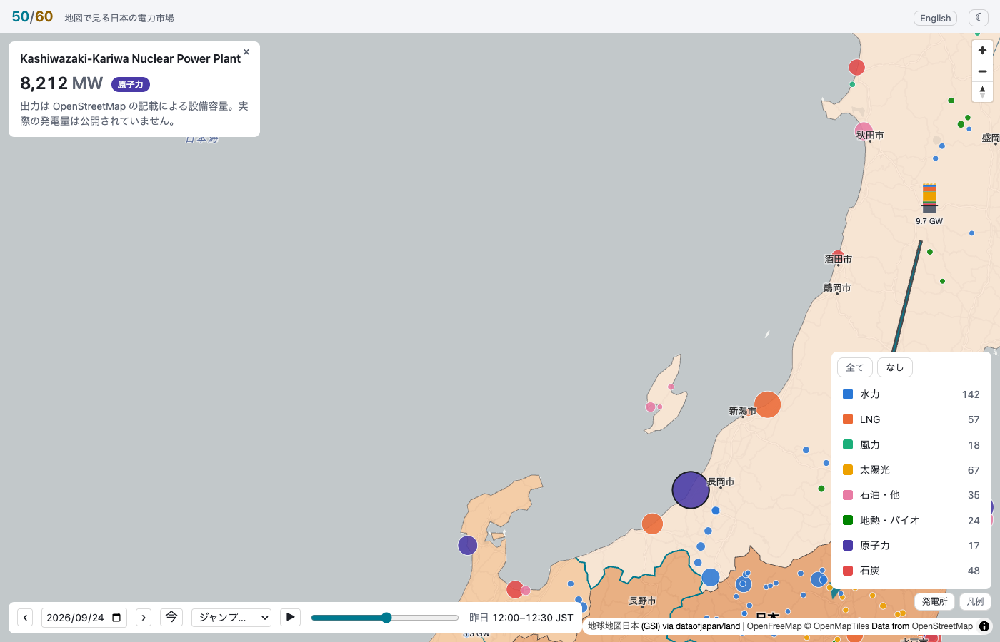
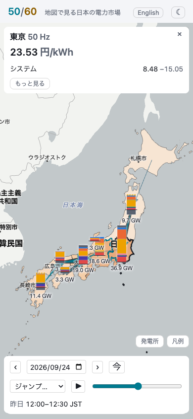

# fiftysixty

Fifty-sixty. More or less.

The Japanese power market on a map: the day-ahead price in each region, what actually ran to meet demand, and the flows between the regions, half hour by half hour, from public data.

Japan's grid is nine regional markets joined by a handful of interconnectors and split down the middle between 50 Hz in the east and 60 Hz in the west. Every half hour each region clears a price on the JEPX exchange, and every half hour the transmission companies publish what ran: nuclear, thermal, hydro, solar, wind, pumped storage, and how much crossed each interconnector. The numbers are public, as tables. This draws them.

Unofficial demo project, built from public data; not affiliated with any exchange, grid operator or utility.

Live at [fiftysixty.misaki.fi](https://fiftysixty.misaki.fi). [SCOPE.md](SCOPE.md) is the plan; [ARCHITECTURE.md](ARCHITECTURE.md) explains how it works.





Every capture, one per milestone, is shown in [docs/screenshots](docs/screenshots/README.md). The interface comes in English and Japanese, dark and light.

## What you will see

**The regions.** Each of the nine areas colored by its price in the displayed half-hour slot, with its supply mix beside it: how much of the demand was nuclear, gas, coal, hydro, solar, wind, and how much solar was curtailed.

**The interconnectors.** Arrows between the regions sized by the flow and colored by how close it is to the line's limit, from OCCTO's day-ahead forecast of each line, with a rim where the day-ahead market split across it; the three frequency-converter stations between the two halves are one of the lines, since that is where the east and west prices part.

**The clock.** A time bar over the day with 48 slots and a date picker, so the solar hump can be watched rolling across the country at noon, the price collapsing under it and the evening peak arriving; play runs a day in seconds, and a menu jumps to the days the prices single out, the summer and the winter peak, the widest split, the most at the floor, the cheapest day.

**Closer in.** Zoom in and the plants appear, by fuel and capacity as OpenStreetMap maps them; what each one is running is not public, only the per-area totals, and the map says so.

## The name

Fifty-sixty is the grid: 50 Hz east of the Fossa Magna, 60 Hz west of it, a division from the 1890s that still limits how much power can cross between the halves. It is also what Matti Nykänen said when he meant "more or less", which is what any forecast of tomorrow's price is. Styled 50/60 in the title.

## Data

- **JEPX day-ahead spot market**: system and area prices, bid and contracted volumes, per half hour, one CSV per fiscal year.
- **Area supply-demand records** from the transmission companies, half-hourly, by source; TEPCO first, the other eight as their formats are wired in.
- **OCCTO** for interconnector capacities and flows.
- Region boundaries from the prefecture polygons of [dataofjapan/land](https://github.com/dataofjapan/land), derived from GSI's 地球地図日本 (Global Map Japan); the plants from OpenStreetMap, © OpenStreetMap contributors.

Everything is fetched by a script on the host once an hour and served as static files. No backend, no account, no key.

## Development

```sh
npm install
npm run data      # fetch the current data into public/data
npm run dev       # http://localhost:5173
npm test          # unit and component tests
npm run test:e2e  # browser tests against the built app
```

`./deploy.sh` builds and publishes a release under a web root and installs the hourly data refresh; [nginx.conf.example](nginx.conf.example) is the server block.

## License

MIT. See [LICENSE](LICENSE). The data belongs to its publishers under their own terms and is credited in the app.
