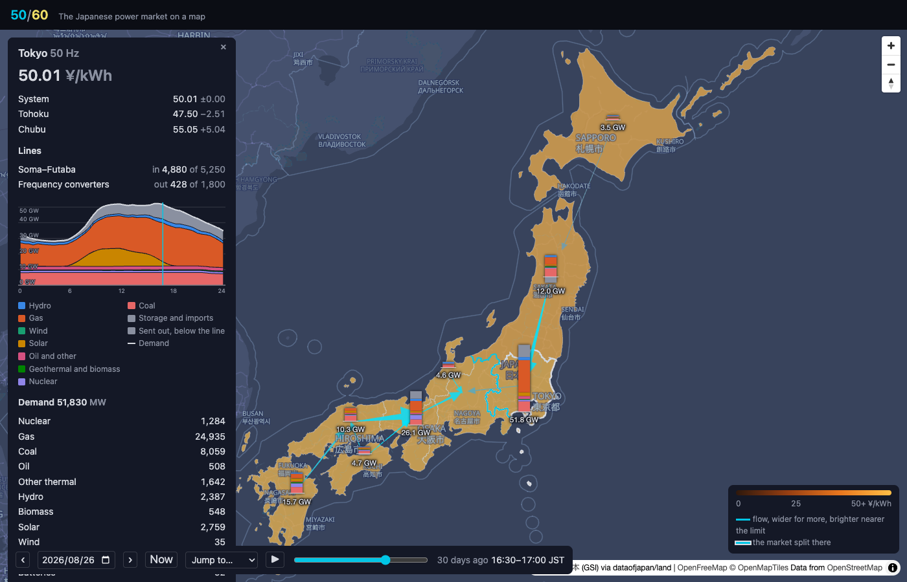
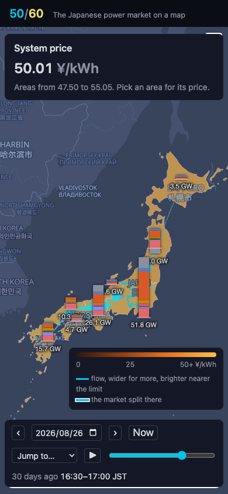
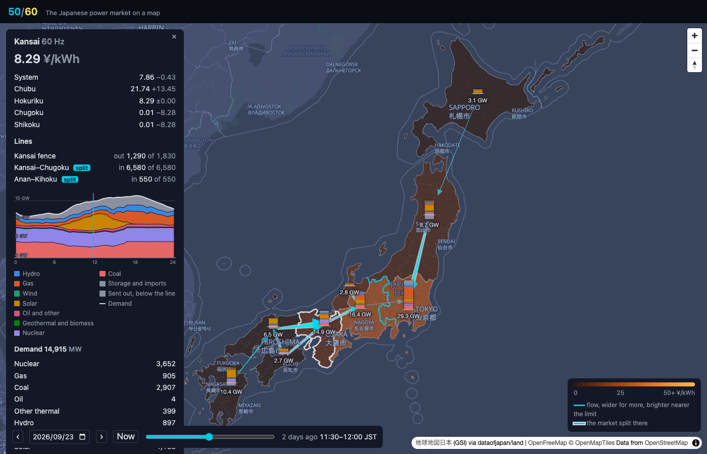
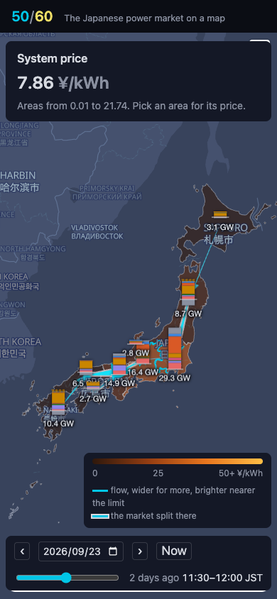

# Screenshots

One capture per milestone, taken with [`scripts/screenshot.mjs`](../../scripts/screenshot.mjs), newest first. The files carry a running number so they sort in order, then a name for what they show; the headings carry the dates. The README shows the latest desktop and phone captures; the rest stay here as a record of how the site grew.

## 2026-09-25 · M5, closer in

Three of M5's four at once: the light theme on the positron basemap, the interface in Japanese with the basemap's labels following, and the map zoomed to zoom 7 over the Sea of Japan coast, where the plants show as dots in the fuels' colors sized by capacity, Kashiwazaki-Kariwa picked with its 8,212 MW in the readout and the note that what it runs is not public. The Plants panel lists the fuels with their counts and filters the dots; the Key and the theme and language buttons sit where they did.

The same in the light theme and Japanese on a phone (390×844), the fourth item of M5: the readout folded to its headline, the key and the plants behind their buttons, the time bar wrapped at the foot.

## 2026-09-25 · M4, play and the story days

The summer peak, found in the prices rather than chosen: 2026-08-26 at 16:30, the system price at the exchange's 50 ¥/kWh cap and every area within a few yen of it, so the whole map glows. Tokyo is picked at 51.8 GW of demand, half of it gas, the Soma–Futaba trunk from Tohoku near its limit and the converters sending a little west. The time bar has the new pieces: the jump menu of story days, the summer and the winter peak, the widest split, the most at the floor and the cheapest day, and the play button that runs a day in twelve seconds.

The same half hour on a phone (390×844), nothing picked, the bar wrapped onto three rows.

## 2026-09-25 · M3, the flows

The holiday noon of 2026-09-23 again, 11:30 to 12:00, with the interconnectors drawn from OCCTO's day-ahead forecast: an arrow along each line the way the power goes, its shaft tapering from a hair at the source to a pixel plus one per gigawatt at the head, brighter the nearer the flow is to the line's limit, and a white rim where the day-ahead market split across it. Kansai is picked: both Kansai–Chugoku circuits and the Anan–Kihoku line from Shikoku come in full and rimmed, 1,290 MW go on from Kansai to Chubu and 539 MW from Hokuriku, resolved from OCCTO's three fences around that triangle, and the readout lists each line's flow in or out against its limit with the split marked. The Tohoku trunk into Tokyo is full and rimmed too, while the converters carry a trickle west to east.

The same half hour on a phone (390×844), nothing picked: the arrows between the columns, the legend keying width, brightness and the rim.

## 2026-09-25 · M2, what ran

Noon on 2026-09-23, with every area's record in: a column beside each of the nine shows what ran in that half hour, the chart's bands stacked with the demand as the height, 29.0 GW in Tokyo down to 2.7 GW in Shikoku. Kansai is picked: it cleared at 9.92 ¥/kWh while Chugoku and Shikoku next door sat at 0.01 and Chubu at 20.00, the west split three ways by the lines between them. The readout draws Kansai's day as the supply stack under the demand line, the half hour marked, and lists the numbers below.

The same noon on a phone (390×844), nothing picked, so the nine columns stand on the map with the system price above and the clock at the foot.

## 2026-09-25 · M1, the price on the map

The nine areas colored by their day-ahead price for the displayed half hour, on a fixed scale from 0 to 50 ¥/kWh so days compare; the 50/60 split line in cyan between Tokyo and Chubu. Tokyo picked, its price against the system price and against Tohoku and Chubu across the interconnectors. The time bar at the foot: the delivery day and a slider over the 48 half hours.
