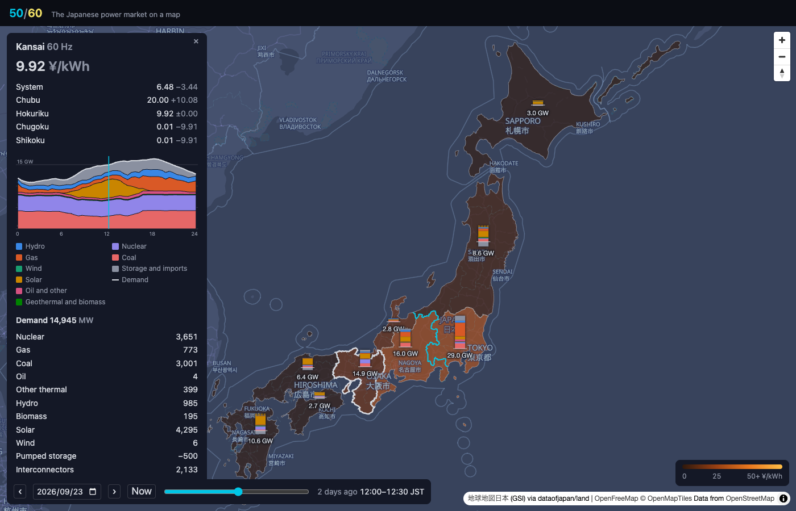
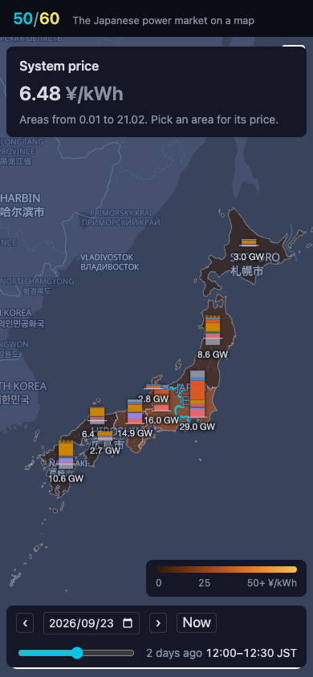
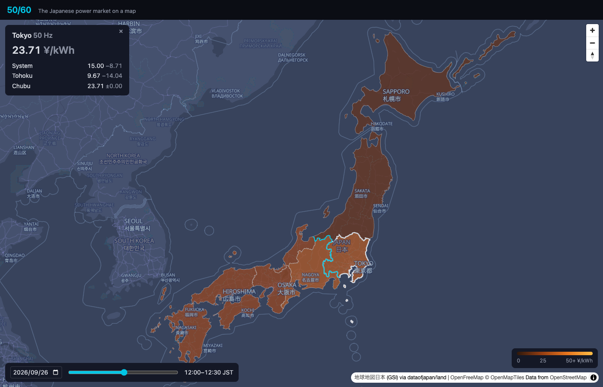

# Screenshots

One capture per milestone, taken with [`scripts/screenshot.mjs`](../../scripts/screenshot.mjs), newest first. The files carry a running number so they sort in order, then a name for what they show; the headings carry the dates. The README shows the latest desktop and phone captures; the rest stay here as a record of how the site grew.

## 2026-09-25 · M2, what ran

Noon on 2026-09-23, with every area's record in: a column beside each of the nine shows what ran in that half hour, the chart's bands stacked with the demand as the height, 29.0 GW in Tokyo down to 2.7 GW in Shikoku. Kansai is picked: it cleared at 9.92 ¥/kWh while Chugoku and Shikoku next door sat at 0.01 and Chubu at 20.00, the west split three ways by the lines between them. The readout draws Kansai's day as the supply stack under the demand line, the half hour marked, and lists the numbers below.

The same noon on a phone (390×844), nothing picked, so the nine columns stand on the map with the system price above and the clock at the foot.

## 2026-09-25 · M1, the price on the map

The nine areas colored by their day-ahead price for the displayed half hour, on a fixed scale from 0 to 50 ¥/kWh so days compare; the 50/60 split line in cyan between Tokyo and Chubu. Tokyo picked, its price against the system price and against Tohoku and Chubu across the interconnectors. The time bar at the foot: the delivery day and a slider over the 48 half hours.
